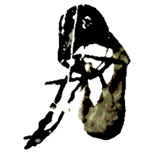

<center>

<h1>knoT here - archived</h1>
</center>

<h2>Description</h2>
</a href="https://www.knot-here.world">knoT here</a> is a minigame designed by <a href="https://www.instagram.com/kambersss">kambersss</a> to announce the 3rd studio album, "marroW", by American musical artist "Brakence". 
<br><br>
This repository serves to archive the game in a playable format, and to preserve it in case the website ever goes down, as well as for offline play. The game has been re-worked just a tad and packaged as an electron binary to run on the desktop.

<h2>Installation</h2>
You can install a pre-built version of the program from the <a href="https://github.com/kevinshome/knot-here/releases">Releases</a> page of this repository.
<h3>Windows</h3>
Download the "knot-here-setup.exe" file and run it. This will install the package to your computer, and you should then be able to run it like any other program.
<h3>macOS</h3>
Download the "knoT Here.app" file, and place it in your "Applications" folder on your computer. You should then be able to run it like any other program.

<h2>Building</h2>
If you would like to build the project from source, you will need the following pre-requisites:

- Node v22 (specifically v22, as I had issues packaging with later versions)
- Python >3.0

To build the project, you will first need to download the media files. The recommended way to do this is to run `downloader.py`, which will automatically download the files and unzip them. 

If you would prefer, you can also manually download them from my personal CDN https://commedesgarcons.s-ul.eu/47AVdPQa. I have them stored in a .zip file there. Feel free to look through the files, store them on your own server/CDN, etc. I grabbed most of these directly from the website itself, with a few missing pieces taken from <a href="https://drive.google.com/drive/folders/1BFfwZfAzVsi0CWhEvBFA6w77HA6fuRBU?usp=sharing">Discord user _nich's Google Drive archive</a>.

After downloading the media files, run the following commands to build the package:
```
npm install # Install necessary Node.js dependencies
npm run package # Package into electron executable
```
This will create a directory called "out" in which your package will be located.

You can also simply run the package, without building it, by running:
```
npm run start
```

<h2>Credits</h2>

- <a href="https://www.instagram.com/kambersss">@kambersss</a> for designing the art
- <a href="https://www.instagram.com/brakence">@brakence</a> for creating the world and music
- @_nich on discord for their archive, from which I was able to complete mine

All elements of this project Copyright © 2026 Sony Music Entertainment. If you are the copyright holder of these works, and would like this repository taken down, please email noah@kevinsho.me with any and all takedown requests.